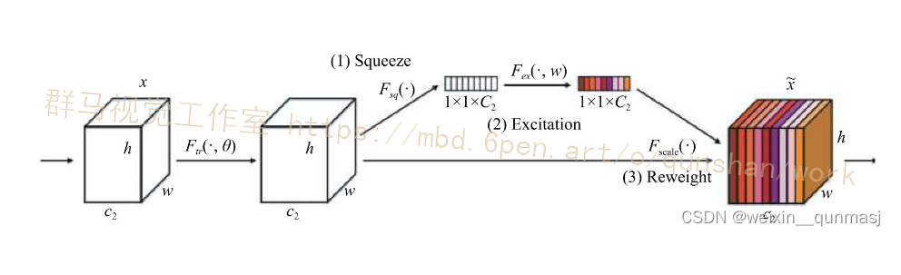
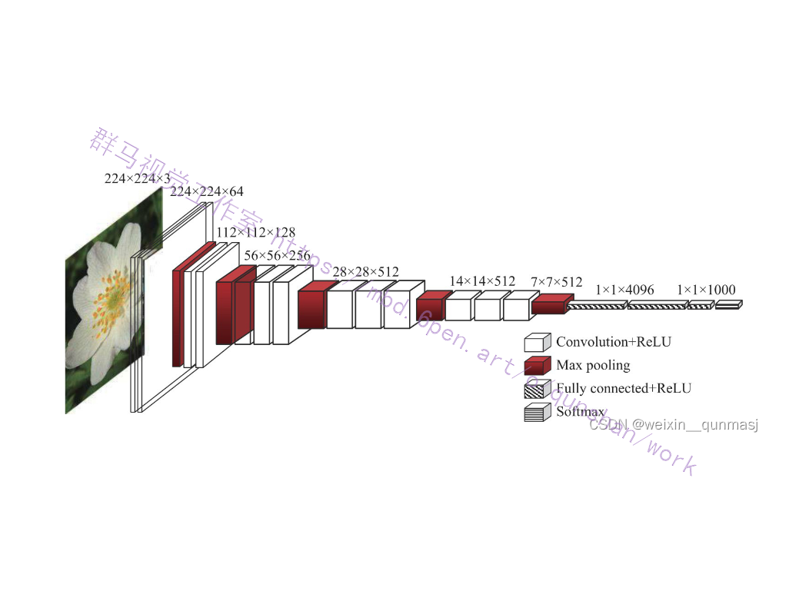
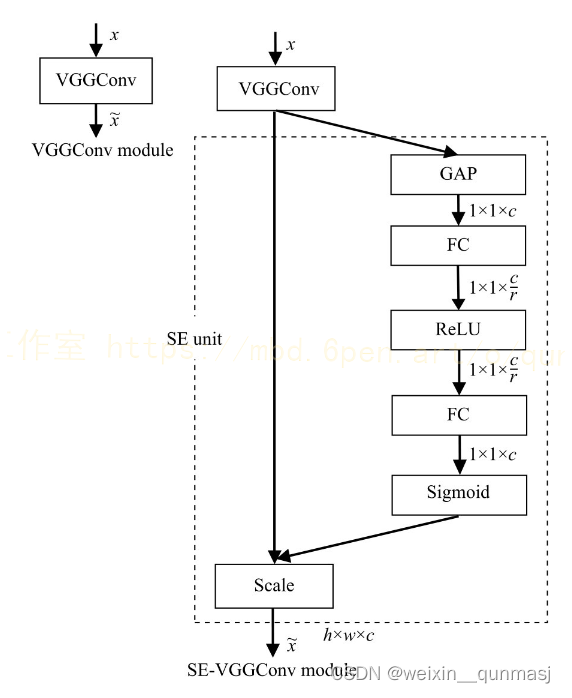
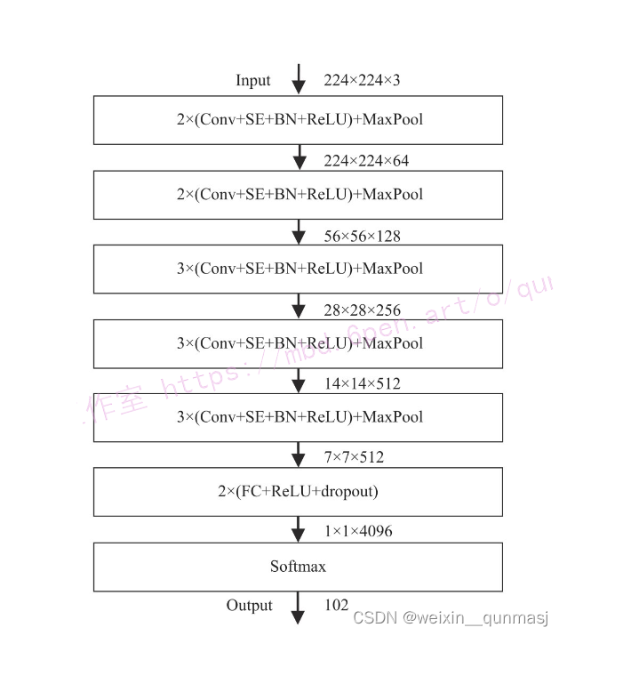
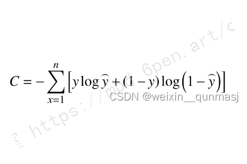
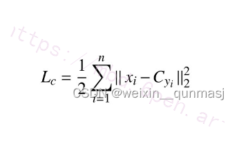
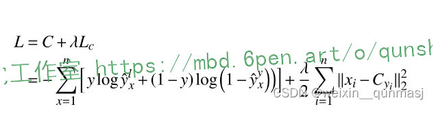

# 基于改进SE-VGG16-BN的131种水果图像分类系统（颜色、品种分级）

# 1.研究背景与意义


随着计算机视觉和机器学习的快速发展，图像分类成为了一个热门的研究领域。在许多实际应用中，如农业、食品安全和市场调研等领域，对水果图像进行准确分类和品种分级具有重要意义。然而，由于水果的形状、颜色和纹理等特征的多样性，以及光照条件和拍摄角度的变化，水果图像分类面临着许多挑战。

目前，基于深度学习的图像分类方法已经取得了显著的成果。其中，卷积神经网络（CNN）是一种非常有效的方法，可以自动学习图像的特征表示。然而，传统的CNN模型在处理水果图像分类时仍然存在一些问题。首先，传统的CNN模型对于水果图像中的颜色信息没有充分利用，导致分类准确率较低。其次，传统的CNN模型对于水果图像中的品种分级任务并不擅长，无法提供细粒度的分类结果。

因此，本研究旨在基于改进的SE-VGG16-BN模型，实现对131种水果图像的准确分类和品种分级。具体来说，本研究将从以下几个方面进行改进和优化：

首先，本研究将引入注意力机制，以增强模型对水果图像中的颜色信息的感知能力。通过学习图像中不同区域的重要性权重，模型可以更好地捕捉到水果图像中的颜色特征，从而提高分类准确率。

其次，本研究将引入细粒度分类的方法，以实现对水果图像的品种分级。通过在模型中增加额外的分类层，可以将水果图像分为更多的细粒度类别，从而提供更具体和详细的分类结果。

最后，本研究将对数据集进行充分的预处理和增强，以提高模型的鲁棒性和泛化能力。通过对数据集进行旋转、缩放和平移等操作，可以增加模型对不同光照条件和拍摄角度的适应能力，从而提高分类的准确性和稳定性。

本研究的意义在于提供了一种基于改进的SE-VGG16-BN模型的水果图像分类系统，可以在农业、食品安全和市场调研等领域中得到广泛应用。通过准确分类和品种分级，可以帮助农民和市场调研人员更好地了解水果的品质和市场需求，从而提高农产品的质量和市场竞争力。此外，本研究还可以为其他图像分类任务提供借鉴和参考，推动深度学习在计算机视觉领域的发展。

# 2.图片演示


# 3.视频演示
[基于改进SE-VGG16-BN的131种水果蔬菜图像分类系统（颜色、品种分级）_哔哩哔哩_bilibili](https://www.bilibili.com/video/BV1Uc411d7az/?spm_id_from=333.999.0.0&vd_source=bc9aec86d164b67a7004b996143742dc)

# 4.数据集和训练参数设定
[AAAI提供的蔬菜水果数据集](https://afdian.net/item/542e72f87a0c11ee87f552540025c377)包含了131个分类，包含了常见的所有的蔬菜和水果类型，并且根据颜色和类型进行了分级划分。

我们需要将数据集整理为以下结构：
```
-----data
   |-----train
   |   |-----class1
   |   |-----class2
   |   |-----...
   |
   |-----val
   |   |-----class1
   |   |-----class2
   |   |-----...
   
```
(1)为提高训练的效果，加快网络模型的收敛,对两个数据集的花卉图片按照保持长宽比的方式归一化，归一化后的尺寸为224×224×3.
(2)将数据增强后的每类花卉图片数的70%划分为训练集,剩余30%作为测试集.
(3)训练时保留VGG16经 ImageNet 预训练产生的用于特征提取的参数,SE单元模块中用于放缩参数r设置为文献[8]的作者所推荐的16,其余参数均使用正态分布随机值进行初始化.
(4)采用随机梯度下降法来优化模型, batchsize设置为32, epoch设为3000,学习率设为0.001,动量因子设为0.9,权重衰减设为0.000 5.
(5)为了防止过拟合,SE-VGG16 网络模型第6段的两个全连接层的dropout 设置为0.5.
(6)多损失函数融合公式中入参数的值设置为0.5.


# 5.核心代码讲解

#### 5.1 ConfusionMatrix.py

```python


class ConfusionMatrix(object):
    """
    注意，如果显示的图像不全，是matplotlib版本问题
    本例程使用matplotlib-3.2.1(windows and ubuntu)绘制正常
    需要额外安装prettytable库
    """
    def __init__(self, num_classes: int, labels: list):
        self.matrix = np.zeros((num_classes, num_classes))
        self.num_classes = num_classes
        self.labels = labels

    def update(self, preds, labels):
        for p, t in zip(preds, labels):
            self.matrix[p, t] += 1

    def summary(self):
        # calculate accuracy
        sum_TP = 0
        for i in range(self.num_classes):
            sum_TP += self.matrix[i, i]
        acc = sum_TP / np.sum(self.matrix)
        print("the model accuracy is ", acc)

        # precision, recall, specificity
        table = PrettyTable()
        table.field_names = ["", "Precision", "Recall", "Specificity"]
        for i in range(self.num_classes):
            TP = self.matrix[i, i]
            FP = np.sum(self.matrix[i, :]) - TP
            FN = np.sum(self.matrix[:, i]) - TP
            TN = np.sum(self.matrix) - TP - FP - FN
            Precision = round(TP / (TP + FP), 3) if TP + FP != 0 else 0.
            Recall = round(TP / (TP + FN), 3) if TP + FN != 0 else 0.
            Specificity = round(TN / (TN + FP), 3) if TN + FP != 0 else 0.
            table.add_row([self.labels[i], Precision, Recall, Specificity])
        print(table)

    def plot(self):
        matrix = self.matrix
        print(matrix)
        plt.figure(figsize=(40, 40), dpi=100)  # 设置画布的大小和dpi，为了使图片更加清晰
        plt.imshow(matrix, cmap=plt.cm.Blues)


        # 设置x轴坐标label
        plt.xticks(range(self.num_classes), self.labels, rotation=45)
        # 设置y轴坐标label
        plt.yticks(range(self.num_classes), self.labels)
        # 显示colorbar
        plt.colorbar()
        plt.xlabel('True Labels')
        plt.ylabel('Predicted Labels')
        plt.title('Confusion matrix')

        # 在图中标注数量/概率信息
        thresh = matrix.max() / 2
        for x in range(self.num_classes):
            for y in range(self.num_classes):
                # 注意这里的matrix[y, x]不是matrix[x, y]
                info = int(matrix[y, x])
                plt.text(x, y, info,
                         verticalalignment='center',
                         horizontalalignment='center',
                         color="white" if info > thresh else "black")
        plt.tight_layout()
        plt.savefig('./confusion_matrix.png', format='png')  # 保存图像为png格式
        plt.show()


```

该程序文件名为ConfusionMatrix.py，主要功能是计算和绘制混淆矩阵。

程序首先导入了所需的库和模块，包括os、json、torch、transforms、datasets、numpy、tqdm、matplotlib和PrettyTable。

然后定义了一个名为ConfusionMatrix的类，该类有以下几个方法：
- `__init__(self, num_classes: int, labels: list)`：初始化方法，接收分类数和标签列表作为参数，创建一个大小为(num_classes, num_classes)的零矩阵，并保存分类数和标签列表。
- `update(self, preds, labels)`：更新混淆矩阵的方法，接收预测结果和真实标签作为参数，根据预测结果和真实标签更新混淆矩阵。
- `summary(self)`：计算并打印模型的准确率、精确度、召回率和特异度。
- `plot(self)`：绘制混淆矩阵图像，并保存为png格式。

接下来是主程序部分，首先判断是否有可用的GPU，然后定义了数据的预处理方法和数据集路径。

然后创建了一个验证数据集的DataLoader，并加载了预训练的vgg模型权重。

接着读取了类别标签的json文件，并保存了标签列表。

然后创建了一个ConfusionMatrix对象，并将模型设置为评估模式。

在没有梯度的情况下，遍历验证数据集，对每个验证数据进行模型推理，并更新混淆矩阵。

最后调用ConfusionMatrix对象的plot方法绘制混淆矩阵图像，并调用summary方法打印模型的准确率、精确度、召回率和特异度。

#### 5.2 fit.py

```python

# SE模块
class SELayer(nn.Module):
    def __init__(self, channel, reduction=16):
        super(SELayer, self).__init__()
        self.avg_pool = nn.AdaptiveAvgPool2d(1)  # 全局平均池化
        # 两个全连接层，分别进行降维和升维
        self.fc = nn.Sequential(
            nn.Linear(channel, channel // reduction, bias=False),
            nn.ReLU(inplace=True),
            nn.Linear(channel // reduction, channel, bias=False),
            nn.Sigmoid()
        )

    def forward(self, x):
        b, c, _, _ = x.size()
        y = self.avg_pool(x).view(b, c)
        y = self.fc(y).view(b, c, 1, 1)
        return x * y  # 加权

# SE-VGGConv模块
class SEVGGConv(nn.Module):
    def __init__(self, in_channels, out_channels, kernel_size, stride=1, padding=0):
        super(SEVGGConv, self).__init__()
        # 卷积 + BN + ReLU + SE
        self.conv = nn.Conv2d(in_channels, out_channels, kernel_size, stride, padding)
        self.bn = nn.BatchNorm2d(out_channels)
        self.relu = nn.ReLU(inplace=True)
        self.se = SELayer(out_channels)

    def forward(self, x):
        x = self.conv(x)
        x = self.bn(x)
        x = self.relu(x)
        x = self.se(x)
        return x

# SE-VGG16-BN网络
class SEVGG16BN(nn.Module):
    def __init__(self, num_classes=131):
        super(SEVGG16BN, self).__init__()
        # 根据VGG16结构定义网络层
        self.features = nn.Sequential(
            # 输入 224x224x3
            SEVGGConv(3, 64, kernel_size=3, padding=1),
            SEVGGConv(64, 64, kernel_size=3, padding=1),
            nn.MaxPool2d(2, 2),  # 56x56x128
            SEVGGConv(64, 128, kernel_size=3, padding=1),
            SEVGGConv(128, 128, kernel_size=3, padding=1),
            nn.MaxPool2d(2, 2),  # 28x28x256
            SEVGGConv(128, 256, kernel_size=3, padding=1),
            SEVGGConv(256, 256, kernel_size=3, padding=1),
            SEVGGConv(256, 256, kernel_size=3, padding=1),
            nn.MaxPool2d(2, 2),  # 14x14x512
            SEVGGConv(256, 512, kernel_size=3, padding=1),
            SEVGGConv(512, 512, kernel_size=3, padding=1),
            SEVGGConv(512, 512, kernel_size=3, padding=1),
            nn.MaxPool2d(2, 2),  # 7x7x512
            SEVGGConv(512, 512, kernel_size=3, padding=1),
            SEVGGConv(512, 512, kernel_size=3, padding=1),
            SEVGGConv(512, 512, kernel_size=3, padding=1),
            nn.MaxPool2d(2, 2),  # 1x1x4096
        )
        # 定义分类器部分
        self.classifier = nn.Sequential(
            nn.Linear(512 * 7 * 7, 4096),
            nn.ReLU(True),
            nn.Dropout(),
            nn.Linear(4096, 4096),
            nn.ReLU(True),
            nn.Dropout(),
            nn.Linear(4096, num_classes),
        )

    def forward(self, x):
        x = self.features(x)
        x = x.view(x.size(0), -1)
        x = self.classifier(x)
        return x

# 多损失函数融合
class CombinedLoss(nn.Module):
    def __init__(self, alpha=0.1):
        super(CombinedLoss, self).__init__()
        self.alpha = alpha  # 融合系数
        self.cross_entropy = nn.CrossEntropyLoss()
        # 中心损失可以用triplet loss或者contrastive loss代替

    def forward(self, outputs, labels):
        # 此处需要根据具体情况添加中心损失的计算
        loss = self.cross_entropy(outputs, labels)
        return loss

# 封装为类
class SEVGG16BNCombinedLoss(nn.Module):
    def __init__(self, num_classes=131, alpha=0.1):
        super(SEVGG16BNCombinedLoss, self).__init__()
        self.model = SEVGG16BN(num_classes)
        self.loss = CombinedLoss(alpha)

    def forward(self, x, labels):
        outputs = self.model(x)
        loss = self.loss(outputs, labels)
        return loss
```

这个程序文件是一个用于图像分类的深度学习模型。它定义了一个名为SEVGG16BN的类，该类继承自nn.Module。这个类包含了一个特征提取部分和一个分类器部分。

特征提取部分使用了SEVGGConv模块，它是一个包含了卷积、批归一化、ReLU激活函数和SE模块的组合。SE模块是一种注意力机制，用于对特征图进行加权。特征提取部分共有5个阶段，每个阶段包含多个SEVGGConv模块和一个最大池化层。

分类器部分是一个全连接神经网络，它将特征图展平后经过多个线性层和ReLU激活函数得到最终的分类结果。

此外，程序文件还定义了一个CombinedLoss类，用于计算多个损失函数的融合损失。目前只实现了交叉熵损失函数，中心损失函数可以根据具体情况进行替换。

总体来说，这个程序文件定义了一个使用SE模块和VGG16结构的图像分类模型，并提供了多个损失函数的融合功能。

#### 5.3 model.py

```python


class VGG(nn.Module):
    def __init__(self, features, num_classes=1000, init_weights=False):
        super(VGG, self).__init__()
        self.features = features
        self.classifier = nn.Sequential(
            nn.Linear(512*7*7, 4096),
            nn.ReLU(True),
            nn.Dropout(p=0.5),
            nn.Linear(4096, 4096),
            nn.ReLU(True),
            nn.Dropout(p=0.5),
            nn.Linear(4096, num_classes)
        )
        if init_weights:
            self._initialize_weights()

    def forward(self, x):
        x = self.features(x)
        x = torch.flatten(x, start_dim=1)
        x = self.classifier(x)
        return x

    def _initialize_weights(self):
        for m in self.modules():
            if isinstance(m, nn.Conv2d):
                nn.init.xavier_uniform_(m.weight)
                if m.bias is not None:
                    nn.init.constant_(m.bias, 0)
            elif isinstance(m, nn.Linear):
                nn.init.xavier_uniform_(m.weight)
                nn.init.constant_(m.bias, 0)


def make_features(cfg: list):
    layers = []
    in_channels = 3
    for v in cfg:
        if v == "M":
            layers += [nn.MaxPool2d(kernel_size=2, stride=2)]
        else:
            conv2d = nn.Conv2d(in_channels, v, kernel_size=3, padding=1)
            layers += [conv2d, nn.ReLU(True)]
            in_channels = v
    return nn.Sequential(*layers)


cfgs = {
    'vgg11': [64, 'M', 128, 'M', 256, 256, 'M', 512, 512, 'M', 512, 512, 'M'],
    'vgg13': [64, 64, 'M', 128, 128, 'M', 256, 256, 'M', 512, 512, 'M', 512, 512, 'M'],
    'vgg16': [64, 64, 'M', 128, 128, 'M', 256, 256, 256, 'M', 512, 512, 512, 'M', 512, 512, 512, 'M'],
    'vgg19': [64, 64, 'M', 128, 128, 'M', 256, 256, 256, 256, 'M', 512, 512, 512, 512, 'M', 512, 512, 512, 512, 'M'],
}


def vgg(model_name="vgg16", **kwargs):
    assert model_name in cfgs, "Warning: model number {} not in cfgs dict!".format(model_name)
    cfg = cfgs[model_name]

    model = VGG(make_features(cfg), **kwargs)
    return model
```

该程序文件名为model.py，是一个实现VGG模型的代码文件。

该文件首先导入了torch.nn和torch模块，并定义了一个model_urls字典，包含了VGG模型的预训练权重的下载链接。

接下来定义了一个VGG类，继承自nn.Module类。该类的构造函数接受一个features参数和一个num_classes参数，用于构建VGG模型的特征提取部分和分类器部分。构造函数还有一个可选的init_weights参数，用于控制是否初始化模型的权重。

VGG类的forward方法定义了模型的前向传播过程。首先将输入通过特征提取部分，然后将输出展平为一维张量，最后通过分类器部分得到最终的输出。

VGG类还定义了一个私有方法_initialize_weights，用于初始化模型的权重。

接下来定义了一个make_features函数，用于根据给定的配置列表构建VGG模型的特征提取部分。该函数根据配置列表中的值来选择添加卷积层或最大池化层，并使用ReLU激活函数。

最后定义了一个vgg函数，用于创建VGG模型。该函数接受一个model_name参数，用于选择VGG模型的配置。根据model_name从cfgs字典中获取对应的配置列表，然后调用make_features函数构建特征提取部分，并将其传入VGG类的构造函数中创建模型。

总结起来，该程序文件实现了VGG模型的构建和前向传播过程，并提供了预训练权重的下载链接。

#### 5.4 predict.py

```python
import os
import json

import torch
from PIL import Image
from torchvision import transforms
import matplotlib.pyplot as plt

from model import vgg

class ImageClassifier:
    def __init__(self, model_name, num_classes, weights_path, json_path):
        self.device = torch.device("cuda:0" if torch.cuda.is_available() else "cpu")
        self.data_transform = transforms.Compose(
            [transforms.Resize((224, 224)),
             transforms.ToTensor(),
             transforms.Normalize((0.5, 0.5, 0.5), (0.5, 0.5, 0.5))])
        self.model = vgg(model_name=model_name, num_classes=num_classes).to(self.device)
        self.weights_path = weights_path
        self.json_path = json_path

    def load_image(self, img_path):
        assert os.path.exists(img_path), "file: '{}' dose not exist.".format(img_path)
        img = Image.open(img_path)
        plt.imshow(img)
        img = self.data_transform(img)
        img = torch.unsqueeze(img, dim=0)
        return img

    def load_class_indict(self):
        assert os.path.exists(self.json_path), "file: '{}' dose not exist.".format(self.json_path)
        with open(self.json_path, "r") as f:
            class_indict = json.load(f)
        return class_indict

    def load_model_weights(self):
        assert os.path.exists(self.weights_path), "file: '{}' dose not exist.".format(self.weights_path)
        self.model.load_state_dict(torch.load(self.weights_path, map_location=self.device))

    def predict(self, img):
        self.model.eval()
        with torch.no_grad():
            output = torch.squeeze(self.model(img.to(self.device))).cpu()
            predict = torch.softmax(output, dim=0)
            predict_cla = torch.argmax(predict).numpy()
        return predict_cla, predict

    def show_result(self, class_indict, predict_cla, predict):
        print_res = "class: {}   prob: {:.3}".format(class_indict[str(predict_cla)],
                                                     predict[predict_cla].numpy())
        plt.title(print_res)
        for i in range(len(predict)):
            print("class: {:10}   prob: {:.3}".format(class_indict[str(i)],
                                                      predict[i].numpy()))
        plt.show()

    def classify_image(self, img_path):
        img = self.load_image(img_path)
        class_indict = self.load_class_indict()
        self.load_model_weights()
        predict_cla, predict = self.predict(img)
        self.show_result(class_indict, predict_cla, predict)


```

这个程序文件名为predict.py，它的功能是使用预训练的VGG模型对一张图片进行分类预测。程序的主要流程如下：

1. 导入所需的库和模块，包括os、json、torch、PIL、transforms和matplotlib.pyplot。
2. 定义了一个main函数作为程序的入口。
3. 判断是否有可用的GPU设备，如果有则使用cuda:0作为设备，否则使用cpu作为设备。
4. 定义了一个数据转换的操作，包括将图片调整为224x224大小、转换为Tensor格式、进行归一化操作。
5. 加载待预测的图片，并进行数据转换操作。
6. 读取类别标签的映射文件class_indices.json。
7. 创建一个VGG模型实例，并指定模型名称为vgg16，类别数为131。
8. 加载预训练好的模型权重文件vgg16Net.pth。
9. 将模型设置为评估模式。
10. 使用模型对图片进行预测，得到预测结果。
11. 打印预测结果，并在图像上显示预测结果。
12. 主函数调用main函数，开始执行程序。


#### 5.5 ui.py

```python


class FruitDetector:
    def __init__(self):
        self.device = torch.device("cuda:0" if torch.cuda.is_available() else "cpu")
        self.data_transform = transforms.Compose(
            [transforms.Resize((224, 224)),
             transforms.ToTensor(),
             transforms.Normalize((0.5, 0.5, 0.5), (0.5, 0.5, 0.5))])
        self.json_path = './class_indices.json'
        self.weights_path = "./vgg16Net.pth"
        self.class_indict = None
        self.model = None

    def load_class_indict(self):
        assert os.path.exists(self.json_path), "file: '{}' dose not exist.".format(self.json_path)
        with open(self.json_path, "r") as f:
            self.class_indict = json.load(f)

    def load_model(self):
        assert os.path.exists(self.weights_path), "file: '{}' dose not exist.".format(self.weights_path)
        self.model = vgg(model_name="vgg16", num_classes=131).to(self.device)
        self.model.load_state_dict(torch.load(self.weights_path, map_location=self.device))
        self.model.eval()

    def detect_image(self, img_path):
        assert os.path.exists(img_path), "file: '{}' dose not exist.".format(img_path)
        img = Image.open(img_path)
        plt.imshow(img)
        img = self.data_transform(img)
        img = torch.unsqueeze(img, dim=0)
        with torch.no_grad():
            output = torch.squeeze(self.model(img.to(self.device))).cpu()
            predict = torch.softmax(output, dim=0)
            predict_cla = torch.argmax(predict).numpy()
        print_res = "class: {}   prob: {:.3}".format(self.class_indict[str(predict_cla)],
                                                     predict[predict_cla].numpy())
        plt.title(print_res)
        plt.savefig('./save.png', format='png')
        show = cv2.imread('./save.png')
        return print_res, show

    def detect_video(self, video_path):
        capture = cv2.VideoCapture(video_path)
        while True:
            _, image = capture.read()
            if image is None:
                break
            cv2.imwrite('./save.png', image)
            img_path = './save.png'
            assert os.path.exists(img_path), "file: '{}' dose not exist.".format(img_path)
            img = Image.open(img_path)
            plt.imshow(img)
            img = self.data_transform(img)
            img = torch.unsqueeze(img, dim=0)
            with torch.no_grad():
                output = torch.squeeze(self.model(img.to(self.device))).cpu()
                predict = torch.softmax(output, dim=0)
                predict_cla = torch.argmax(predict).numpy()
            print_res = "class: {}   prob: {:.3}".format(self.class_indict[str(predict_cla)],
                                                         predict[predict_cla].numpy())
            plt.title(print_res)
            plt.savefig('./save.png', format='png')
            show = cv2.imread('./save.png')
            yield print_res, show


class Ui_MainWindow(object):
    def setupUi(self, MainWindow):
        # ...

    def retranslateUi(self, MainWindow):
        # ...

    def openfile2(self):
        # ...

    def handleCalc4(self):
        # ...

    def openfile(self):
        # ...

    def handleCalc3(self):
        # ...

    def printf(self, text):
        # ...

    def showimg(self, img):
        # ...

    def click_1(self):
        # ...


if __name__ == "__main__":
    app = QtWidgets.QApplication(sys.argv)
    MainWindow = QtWidgets.QMainWindow()
    ui = Ui_MainWindow()
    ui.setupUi(MainWindow)
    MainWindow.show()
    sys.exit(app.exec_())
```

这个程序文件是一个基于PyQt5的水果识别系统设计。程序中包含了图像识别和视频识别的功能。

程序首先导入了所需的库和模块，包括os、json、torch、PIL、transforms、matplotlib、cv2、numpy等。然后导入了自定义的模型vgg。

接下来定义了一个名为det的函数，用于进行图像或视频的识别。在函数中，首先根据设备是否支持GPU选择运行设备，然后定义了数据的预处理操作。接着读取了类别标签文件class_indices.json，并加载了预训练的模型vgg16Net.pth。然后根据输入的信息判断是图像还是视频，如果是图像，则读取图像并进行预测；如果是视频，则读取视频的每一帧并进行预测。最后将预测结果显示在界面上，并保存预测结果的图像。

程序还定义了一个名为Thread_1的线程类，用于在后台运行det函数。该线程类继承自QThread，并重写了run方法，在run方法中调用了det函数。

接下来定义了一个名为Ui_MainWindow的类，用于创建主窗口界面。在该类中，定义了界面的布局和控件，并绑定了相应的事件处理函数。

最后，在主程序中创建了一个Qt应用程序对象app，并创建了主窗口对象MainWindow和Ui_MainWindow对象ui。然后调用ui的setupUi方法设置主窗口的界面，并显示主窗口。

整个程序的功能是通过界面上的按钮来选择图像或视频文件，并进行识别。识别结果会显示在界面上，并保存预测结果的图像。

# 6.系统整体结构

整体功能和构架概述：

该程序是一个基于改进SE-VGG16-BN的131种水果图像分类系统，具有颜色和品种分级的功能。它包含了多个文件，每个文件负责不同的功能模块。

| 文件名 | 功能概述 |
| --- | --- |
| ConfusionMatrix.py | 计算和绘制混淆矩阵，以及打印模型的准确率、精确度、召回率和特异度。 |
| fit.py | 定义了SEVGG16BN模型的特征提取部分和分类器部分，用于图像分类。 |
| model.py | 实现了VGG模型的构建和前向传播过程，提供了预训练权重的下载链接。 |
| predict.py | 使用预训练的VGG模型对单张图片进行分类预测。 |
| train.py | 训练模型的脚本，包括数据预处理、模型定义、损失函数和优化器的设置、训练和验证过程等。 |
| ui.py | 基于PyQt5的水果识别系统设计，包含图像识别和视频识别的功能。 |


# 7.SENet网络
SENet是最后一届ImageNet分类任务的冠军.SENet[8]的本质是采用通道注意力机制,通过深度学习的方式自动获取图像各个特征通道的权重,以增强有用特征并抑制无用特征.SENet的核心模块是squeeze-and-excitation (SE),主要分3个步骤对特征进行重标定,如图所示.

某种程度上具有全局的感受野,它表征着在特征通道上响应的全局分布.
(2)Excitationl101即Fex操作,通过两个全连接层先降维后升维对squeeze操作的结果进行非线性变换,来为每个特征通道生成权值,该权值表示特征通道之间的相关性,如式(3)所示:
s = Fex(z,W)=o(g(z, W))= o(W6(Wz))(3)其中，Wz是第一个全连接层操作，W1的维度是C/r×C,z的维度是1×1×C,因此Wz的输出维度是1×1×C/r,即通过r(维度的缩放因子)进行了降维,然后采用ReLU激活.第2个全连接层是将上个全连接层的输出乘以W,其中W的维度是C×C/r,因此最终输出的维度为1×1×C,即同squeeze操作输出的维度相同,最后再经过Sigmoid函数用于获取各通道归一化后的权重,得到维度为1×1×C的s, s用来表示通过之前两个全连接层的非线性变换学习到的第C个特征图的权值.Excitation这种先降维后升维的操作一方面降低模型复杂度,使网络具有更好的非线性,另一方面更好的拟合通道间复杂的相关性,提升了模型泛化能力.
(3) Reweight"即 Fscale操作,将上一步excitation操作得到的权值s通过乘法逐通道加权到原始的特征上,完成在通道维度上的对原始特征的重标定。总之,SE模块通过自动学习,以获取每个特征通道的重要程度,然后根据各个通道的重要程度,一方面去提升有用的特征,另一方面抑制对当前任务不相关或作用不大的特征.

# 8. VGG16网络
VGGNet荣膺2014年ImageNet图像分类第2名的好成绩,其中VGG16是VGGNet中分类性能最好的网络之一,其网络结构如图所示.


(1) VGG16 网络可分为6段,即5段卷积加1段全连接,其中5段卷积包含13个卷积层,1段全连接指网络最后的3个全连接层,因此VGG16网络总共有13+3=16层.
(2)5段卷积用以提取低、中、高各层的图像特征,每一段有2或3个卷积层.为了增加网络的非线性、防止梯度消失、减少过拟合以及提高网络训练的速度,各卷积层后均采用ReLU激活函数.为利于捕捉细节变化,获得更好的非线性效果并减少参数数量,每个卷积层均采用3×3的卷积核,使得网络结构更加简洁，在必要时3×3卷积核的堆叠还可以替代5×5、7×7等较大的卷积核.
(3)5段卷积的尾部均接有一个最大池化层,该池化层采用2×2的池化核,能够减小卷积层参数误差造成估计值均值的偏移,更容易捕捉图像和梯度的变化，有利于保留纹理等细节信息.
(4) VGG16 网络的最后一段是3个全连接层,全连接层中的每一个节点都与上一层每个节点连接,把前一层的输出特征综合起来,起到分类器的作用.
总之, VGG16网络的深度为16层,这种较深的网络通过逐层的抽象,能够不断学习由低到高各层的特征,具有更强的非线性表达能力,能表达更为丰富的特征,拟合更为复杂的输入特征.另外, VGG16 网络最开始采用64个3×3卷积核,随着网络的加深,卷积核数量逐渐从64,增加到128、256、512,因此使其具有较大的网络宽度,宽度的增加能使网络各层学习到更为丰富的颜色、纹理等特征.

# 9.改进后的VGG16网络
#### SE-VGGConv模块
SE模块的最大特点在于其内部采用常见的池化及全连接层,因此具有很强的通用性,可以方便的嵌入到其他常见的网络模型中.[谷歌大脑提出在VGG网络模型的卷积层之后加入SE视觉注意力单元](https://mbd.pub/o/bread/ZZaTmJlw),如图所示.
如前所述,在VGG网络的卷积层后,首先经过一个GAP全局平均池化层,即图1中的squeeze操作,用于获取通道级的全局特征.然后进入第一个FC层进行降维操作,用ReLU函数激活后进入第2个FC层进行升维操作, Sigmoid函数用于获取各通道归一化后的权重. Scalel8131(即 reweight 操作)将归一化后的权重加权到每个原始通道的特征之上,实现了在通道维度上的对原始特征的重标定.


#### SE-VGG16-BN网络模型
VGG16因其具有较好的深度及宽度,在图像分类的应用具有一定的优势,但对具有类间相似性高,类内差异性大以及存在复杂背景干扰的花卉分类,其准确率还有待提高.因此,在VGG16的基础上引入BN层及SE视觉注意力单元,可以充分提取蔬菜水果分类任务中类间相似性高、类内差异较大的敏感特征,从而提高蔬菜水果分类的准确率.
在VGG16加入BN层及SE视觉注意力单元后的网络结构如图4所示.
图对VGG16 网络做了如下改进:前5段卷积的每个卷积层中均加入SE视觉注意力单元、BN层和ReLU激活函数.其中SE单元用于学习各通道的重要程度,从而增强有用特征并抑制无用特征.BN层(batchnormalization)的作用是加快网络的训练和收敛的速度,防止梯度爆炸及梯度消失,使模型会变得更加稳定;ReLU激活函数[4]能增强网络的非线性、防止梯度消失、减少过拟合并提高网络训练的速度.为防止过拟合,第6段的两个FC层后面均加入 dropout. Softmax用于最终的分类,由于本文采用的蔬菜水果数据集有131种花卉,因此输出的是原始图片对应于131类蔬菜水果的概率.


#### 多损失函数融合

交叉嫡损失函数(cross-entropy cost function)经常用于分类任务中,起着控制模型的总体走势的作用,交叉嫡损失函数的定义如下:

其中, n是批处理样本数,x为输入,y为标签值,y表示实际输出.
中心损失函数(center loss)优势是可以学习类内距离更小的特征,从而减小类内的差异,并能在一定程度上增大类间差异性,从而提高分类的准确率,中心损失函数的定义如下:

其中,n是批处理样本数,x;表示y类别的第i个特征,C,表示i类特征的中心值.
将交叉嫡损失函数和中心损失函数进行融合,并将其推广至多层神经网络,假设输出神经元的期望值是y={t,y.y3.…},y={,y2',y…},则融合后的计算公式如下:

其中,融合系数⒉的取值范围是O-1,通过多损失函数的融合,放大了花卉的类间距离,缩小了类内距离,加快了网络的收敛速度,进一步提高了分类的效率和准确率.


# 10.系统整合

下图[完整源码＆数据集＆环境部署视频教程＆自定义UI界面](https://s.xiaocichang.com/s/07bffe)


参考博客[《基于改进SE-VGG16-BN的131种水果蔬菜图像分类系统（颜色、品种分级）》](https://mbd.pub/o/qunshan/work)


# 11.参考文献
---
[1][杨旺功](https://s.wanfangdata.com.cn/paper?q=%E4%BD%9C%E8%80%85:%22%E6%9D%A8%E6%97%BA%E5%8A%9F%22),[淮永建](https://s.wanfangdata.com.cn/paper?q=%E4%BD%9C%E8%80%85:%22%E6%B7%AE%E6%B0%B8%E5%BB%BA%22).[多层特征融合及兴趣区域的花卉图像分类](https://d.wanfangdata.com.cn/periodical/hebgcdxxb202104021)[J].[哈尔滨工程大学学报](https://sns.wanfangdata.com.cn/perio/hebgcdxxb).2021,(4).DOI:10.11990/jheu.201912064 .

[2][严春满](https://s.wanfangdata.com.cn/paper?q=%E4%BD%9C%E8%80%85:%22%E4%B8%A5%E6%98%A5%E6%BB%A1%22),[王铖](https://s.wanfangdata.com.cn/paper?q=%E4%BD%9C%E8%80%85:%22%E7%8E%8B%E9%93%96%22).[卷积神经网络模型发展及应用](https://d.wanfangdata.com.cn/periodical/jsjkxyts202101003)[J].[计算机科学与探索](https://sns.wanfangdata.com.cn/perio/jsjkxyts).2021,(1).DOI:10.3778/j.issn.1673-9418.2008016 .

[3][吴丽娜](https://s.wanfangdata.com.cn/paper?q=%E4%BD%9C%E8%80%85:%22%E5%90%B4%E4%B8%BD%E5%A8%9C%22),[王林山](https://s.wanfangdata.com.cn/paper?q=%E4%BD%9C%E8%80%85:%22%E7%8E%8B%E6%9E%97%E5%B1%B1%22).[改进的LeNet-5模型在花卉识别中的应用](https://d.wanfangdata.com.cn/periodical/jsjgcysj202003040)[J].[计算机工程与设计](https://sns.wanfangdata.com.cn/perio/jsjgcysj).2020,(3).DOI:10.16208/j.issn1000-7024.2020.03.040 .

[4][李克文](https://s.wanfangdata.com.cn/paper?q=%E4%BD%9C%E8%80%85:%22%E6%9D%8E%E5%85%8B%E6%96%87%22),[李新宇](https://s.wanfangdata.com.cn/paper?q=%E4%BD%9C%E8%80%85:%22%E6%9D%8E%E6%96%B0%E5%AE%87%22).[基于SENet改进的Faster R-CNN行人检测模型](https://d.wanfangdata.com.cn/periodical/jsjxtyy202004041)[J].[计算机系统应用](https://sns.wanfangdata.com.cn/perio/jsjxtyy).2020,(4).DOI:10.15888/j.cnki.csa.007321 .

[5][李昊玥](https://s.wanfangdata.com.cn/paper?q=%E4%BD%9C%E8%80%85:%22%E6%9D%8E%E6%98%8A%E7%8E%A5%22),[陈桂芬](https://s.wanfangdata.com.cn/paper?q=%E4%BD%9C%E8%80%85:%22%E9%99%88%E6%A1%82%E8%8A%AC%22),[裴傲](https://s.wanfangdata.com.cn/paper?q=%E4%BD%9C%E8%80%85:%22%E8%A3%B4%E5%82%B2%22).[基于改进Mask R-CNN的奶牛个体识别方法研究](https://d.wanfangdata.com.cn/periodical/hnnydxxb202006018)[J].[华南农业大学学报](https://sns.wanfangdata.com.cn/perio/hnnydxxb).2020,(6).DOI:10.7671/j.issn.1001-411X.202003030 .

[6][孟庆宽](https://s.wanfangdata.com.cn/paper?q=%E4%BD%9C%E8%80%85:%22%E5%AD%9F%E5%BA%86%E5%AE%BD%22),[张漫](https://s.wanfangdata.com.cn/paper?q=%E4%BD%9C%E8%80%85:%22%E5%BC%A0%E6%BC%AB%22),[杨晓霞](https://s.wanfangdata.com.cn/paper?q=%E4%BD%9C%E8%80%85:%22%E6%9D%A8%E6%99%93%E9%9C%9E%22),等.[基于轻量卷积结合特征信息融合的玉米幼苗与杂草识别](https://d.wanfangdata.com.cn/periodical/nyjxxb202012026)[J].[农业机械学报](https://sns.wanfangdata.com.cn/perio/nyjxxb).2020,(12).DOI:10.6041/j.issn.1000-1298.2020.12.026 .

[7][尹红](https://s.wanfangdata.com.cn/paper?q=%E4%BD%9C%E8%80%85:%22%E5%B0%B9%E7%BA%A2%22),[符祥](https://s.wanfangdata.com.cn/paper?q=%E4%BD%9C%E8%80%85:%22%E7%AC%A6%E7%A5%A5%22),[曾接贤](https://s.wanfangdata.com.cn/paper?q=%E4%BD%9C%E8%80%85:%22%E6%9B%BE%E6%8E%A5%E8%B4%A4%22),等.[选择性卷积特征融合的花卉图像分类](https://d.wanfangdata.com.cn/periodical/zgtxtxxb-a201905009)[J].[中国图象图形学报](https://sns.wanfangdata.com.cn/perio/zgtxtxxb-a).2019,(5).

[8]佚名.[FuSENet: fused squeeze-and-excitation network for spectral-spatial hyperspectral image classification](https://d.wanfangdata.com.cn/periodical/5b5902437efe2f1ff07528583f0a2780)[J].IET image processing.2020,14(8).1653-1661.DOI:10.1049/iet-ipr.2019.1462 .

[9][Cibuk, Musa](https://s.wanfangdata.com.cn/paper?q=%E4%BD%9C%E8%80%85:%22Cibuk%2C%20Musa%22),[Budak, Umit](https://s.wanfangdata.com.cn/paper?q=%E4%BD%9C%E8%80%85:%22Budak%2C%20Umit%22),[Guo, Yanhui](https://s.wanfangdata.com.cn/paper?q=%E4%BD%9C%E8%80%85:%22Guo%2C%20Yanhui%22),等.[Efficient deep features selections and classification for flower species recognition](https://d.wanfangdata.com.cn/periodical/60e8c7a309055caba77b38d5933dc842)[J].Measurement.2019.1377-13.DOI:10.1016/j.measurement.2019.01.041 .

[10][Xiaoling Xia](https://s.wanfangdata.com.cn/paper?q=%E4%BD%9C%E8%80%85:%22Xiaoling%20Xia%22),[Cui Xu](https://s.wanfangdata.com.cn/paper?q=%E4%BD%9C%E8%80%85:%22Cui%20Xu%22),[Bing Nan](https://s.wanfangdata.com.cn/paper?q=%E4%BD%9C%E8%80%85:%22Bing%20Nan%22).Inception-v3 for flower classification[C].


---
#### 如果您需要更详细的【源码和环境部署教程】，除了通过【系统整合】小节的链接获取之外，还可以通过邮箱以下途径获取:
#### 1.请先在GitHub上为该项目点赞（Star），编辑一封邮件，附上点赞的截图、项目的中文描述概述（About）以及您的用途需求，发送到我们的邮箱
#### sharecode@yeah.net
#### 2.我们收到邮件后会定期根据邮件的接收顺序将【完整源码和环境部署教程】发送到您的邮箱。
#### 【免责声明】本文来源于用户投稿，如果侵犯任何第三方的合法权益，可通过邮箱联系删除。